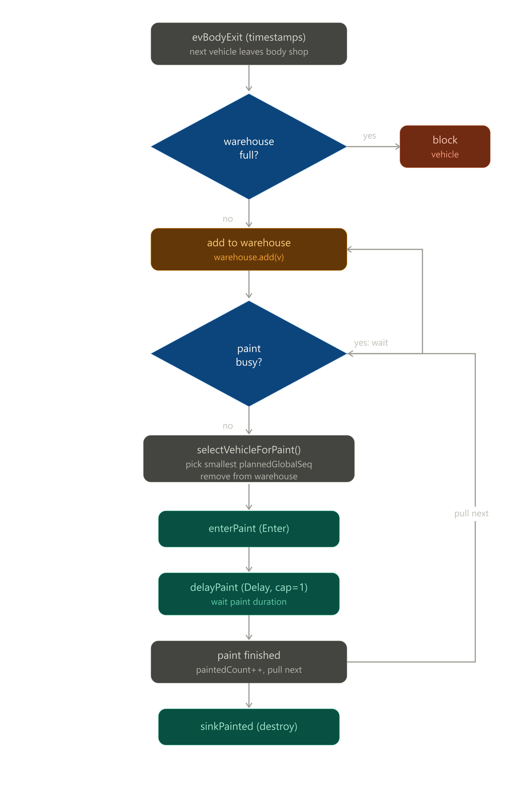
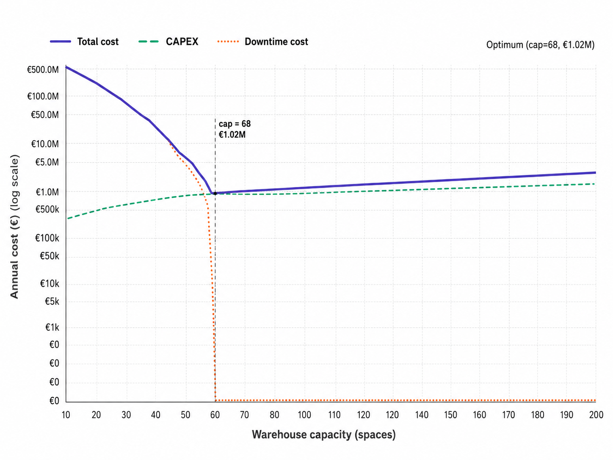

# Body–Paint Resequencing Warehouse — Simulation Model

An AnyLogic discrete-event model that replays one year of real production data (48,000 vehicles) to determine the optimal size of a resequencing warehouse placed between an automotive body shop and paint shop.

---

## 1. The problem

In a car plant, vehicles are *planned* to be built in a fixed order — the `planned_global_sequence`. Paint shops strongly prefer to receive cars in that planned order, because it groups colors efficiently and keeps the downstream assembly line synchronized.

The trouble is the **body shop is variable**. Some vehicles take longer than others, some get delayed, and as a result vehicles leave the body shop **out of their planned order**. In this dataset, 12,841 of 48,000 vehicles (≈27%) exit the body shop in a different position than planned.

To absorb this variability, the plant installs a **warehouse (buffer)** between body and paint. The warehouse holds vehicles temporarily and releases them to paint in the correct planned order — this is *resequencing*. But the warehouse is not free: every parking space costs **€15,000** in capital expenditure (CAPEX). And if the warehouse fills up completely, the body shop has nowhere to send finished vehicles and must **stop** — body-shop downtime costs **€400,000 per hour**.

This creates a trade-off:

- **Too small a warehouse** → it fills up → body shop blocks → huge downtime cost.
- **Too large a warehouse** → no blocking, but wasted CAPEX on empty spaces.

The model finds the warehouse size that minimizes total cost.

---

## 2. Aim of the project

The model answers one decision question for plant management:

> **How many parking spaces should the resequencing warehouse have, given the real variability of our body and paint shops, to minimize total annual cost?**

It does this by:

1. **Replaying** the actual historical body-exit timestamps (trace-driven simulation, not random generation).
2. **Resequencing** vehicles back toward the planned order at the warehouse-to-paint hand-off.
3. **Blocking** the body shop whenever the warehouse is full, and accounting for the resulting downtime cost.
4. **Sweeping** the warehouse capacity from 10 to 200 spaces and reporting the total cost of each size.

---

## 3. How it helps the decision maker

The output is a single cost curve: **total annual cost vs. warehouse capacity**. From this the decision maker gets:

- **The optimal capacity** — the size where total cost is minimized (the bottom of the U-shaped curve).
- **The cost of being wrong** — how much money is lost by building too small (downtime) or too large (wasted CAPEX).
- **A risk margin** — the smallest capacity that eliminates *all* body-shop blocking, providing a safety buffer against years where variability is worse than the historical trace.
- **Confidence the warehouse is justified** — by quantifying the downtime it prevents (hundreds of millions of euros at small capacities), the model proves the warehouse pays for itself many times over.

In short: the model converts a vague engineering instinct ("we need a buffer") into a precise, defensible capital decision backed by a year of real data.

### Headline result (with this dataset)

| Metric | Value |
|---|---|
| Optimal warehouse capacity | **68 spaces** |
| Minimum total annual cost | **€1,020,000** (100% CAPEX, 0% downtime) |
| Cost avoided vs. a 10-space warehouse | ≈ **€713,000,000 / year** |
| Resequencing corrections performed | 2,233 (fixes all 12,841 mismatches) |
| Unavoidable paint-starvation events | 1,784 (body-shop limited, not warehouse-limited) |

---

## 4. Model flow (how it runs)

The model has two independent "engines" that meet only at the warehouse:

**Producer (body shop):** the `evBodyExit` event fires at each historical body-exit timestamp, releasing one vehicle. It then re-arms itself for the next timestamp. This walks through all 48,000 vehicles in chronological order.

**Consumer (paint shop):** paint is a *greedy puller* — whenever it is free and the warehouse has a vehicle, it immediately pulls one. It never sits idle while work is waiting.

The two engines communicate only through the shared `warehouse` list. Step by step:


```
evBodyExit fires (a vehicle leaves the body shop)
        │
        ▼
   ┌──────────────────┐
   │ warehouse full?  │  ◄── decision
   └──────────────────┘
     │ yes        │ no
     ▼            ▼
  BLOCK        add to warehouse
  vehicle           │
  (downtime)        ▼
              ┌──────────────────┐
              │   paint busy?    │  ◄── decision
              └──────────────────┘
                │ yes        │ no
                ▼            ▼
            wait in     selectVehicleForPaint()
            warehouse    (smallest plannedGlobalSeq)
                              │
                              ▼
                     enterPaint → delayPaint → sinkPainted
                              │
                              ▼
                     paint finished → pull next vehicle
                     (loops back to "paint busy?")
```

The body shop and warehouse are modeled in Java code; only the paint stage (`enterPaint → delayPaint → sinkPainted`) sits on the AnyLogic flowchart canvas. The single bridge between code and canvas is the call `enterPaint.take(v)` inside `releaseToPaint()`.

## Main-level variables
```
Main
│
├── Data structures
│   │
│   ├── allVehicles : ArrayList<Vehicle>
│   │   └── Vehicle objects
│   │       ├── vin
│   │       ├── plannedGlobalSeq
│   │       ├── bodyExitDate
│   │       ├── paintProcMin
│   │       ├── paintChangeoverMin
│   │       ├── paintQualityHoldMin
│   │       ├── warehouseEnterTime
│   │       └── wasBlocked
│   │
│   ├── vehiclesByVin : HashMap<String, Vehicle>
│   │   ├── key: VIN String
│   │   └── value: Vehicle object
│   │       └── same Vehicle object also stored in allVehicles
│   │
│   ├── bodyExitEvents : ArrayList<Vehicle>
│   │   └── Vehicle objects sorted by bodyExitDate
│   │
│   ├── warehouse : ArrayList<Vehicle>
│   │   └── Vehicles currently waiting between body and paint
│   │
│   └── blockedAtBodyShop : ArrayList<Vehicle>
│       └── Vehicles waiting because warehouse is full
│
├── Cursor variables
│   └── nextBodyExitIndex
│       └── points to next Vehicle inside bodyExitEvents
│
├── KPI counters
│   ├── paintedCount
│   ├── blockedVehicleCount
│   └── paintStarvedCount
│
├── Blocking-time variables
│   ├── bodyBlockedStartTime
│   └── bodyBlockedMinutes
│
└── Cost variables
    ├── capexCost
    │   ├── warehouseCapacity
    │   └── parkingSpaceCost
    │
    ├── bodyDowntimeCost
    │   ├── bodyBlockedMinutes
    │   └── bodyDowntimeCostPerHour
    │
    └── totalCost
        ├── capexCost
        └── bodyDowntimeCost
```
## Main operational variable graph
```
bodyExitEvents
│
└── evBodyExit
    │
    └── onBodyExit(v)
        │
        ├── if warehouse has space
        │   │
        │   └── warehouse
        │       │
        │       └── releaseToPaint()
        │           │
        │           ├── selectVehicleForPaint()
        │           │   └── uses v.plannedGlobalSeq
        │           │
        │           ├── warehouse.remove(v)
        │           │
        │           ├── admitBlockedVehicleIfPossible()
        │           │   └── blockedAtBodyShop → warehouse
        │           │
        │           └── enterPaint.take(v)
        │               └── delayPaint
        │                   └── uses:
        │                       ├── v.paintProcMin
        │                       ├── v.paintChangeoverMin
        │                       └── v.paintQualityHoldMin
        │
        └── if warehouse full
            │
            ├── blockedAtBodyShop
            ├── blockedVehicleCount
            ├── bodyBlockedStartTime
            └── bodyBlockedMinutes
```

## Simple Mental model

```
Startup
│
├── Build vehicles
│   ├── allVehicles
│   └── vehiclesByVin
│
├── Build arrival timeline
│   └── bodyExitEvents
│
└── Attach paint durations
    └── Vehicle paint fields


Simulation runtime
│
├── evBodyExit
│   └── onBodyExit(v)
│       ├── warehouse
│       └── blockedAtBodyShop
│
└── releaseToPaint()
    ├── selectVehicleForPaint()
    │   └── chooses smallest plannedGlobalSeq
    ├── admitBlockedVehicleIfPossible()
    └── enterPaint.take(v)
        └── delayPaint
            ├── paintedCount++
            ├── updateCosts()
            └── releaseToPaint()
```

## 5. Input data (CSV files)

Only five columns across the files are actually used by the model.

| File | Columns used | Purpose |
|---|---|---|
| `01_production_orders_planned.csv` | `VIN`, `planned_global_sequence` | Defines the target order vehicles should reach paint in |
| `02_bodyshop_output_actual.csv` | `VIN`, `body_exit_time` | The actual moment each vehicle left the body shop — drives arrivals into the warehouse |
| `03_paintshop_input_actual.csv` | `VIN`, `paint_proc_min`, `paint_changeover_min`, `paint_quality_hold_min` | The three components that sum to each vehicle's paint duration |

`04_downtime_events.csv` is not consumed directly — its effects are already baked into the historical body-exit and paint timestamps.

---

## 6. Parameters

Parameters are the experiment knobs. They are constant during one run and changed only between runs (e.g. the capacity sweep).

| Parameter | Type | Default | Aim |
|---|---|---|---|
| `warehouseCapacity` | int | 50 (swept 10–200) | Maximum number of vehicles the warehouse can hold. The variable being optimized. |
| `parkingSpaceCost` | double | 15,000 | CAPEX per warehouse space (€). Multiplier for the capital cost. |
| `bodyDowntimeCostPerHour` | double | 400,000 | Cost (€) of each hour the body shop is blocked. Multiplier for downtime cost. |
| `dataFolder` | String | path | Folder where the model looks for the input CSV files. |

---

## 7. Variables

### 7.1 Data structures (Main)

| Variable | Type | Aim |
|---|---|---|
| `allVehicles` | `ArrayList<Vehicle>` | Master list of all 48,000 vehicle objects. |
| `vehiclesByVin` | `HashMap<String,Vehicle>` | Fast VIN → Vehicle lookup, used to join the three CSVs together. |
| `bodyExitEvents` | `ArrayList<Vehicle>` | All vehicles sorted by body-exit time — the event timeline the producer walks through. |
| `warehouse` | `ArrayList<Vehicle>` | The buffer itself. Vehicles waiting between body and paint. Body adds; paint removes. The resequencing pool. |
| `blockedAtBodyShop` | `ArrayList<Vehicle>` | Overflow queue: vehicles that finished the body shop while the warehouse was full. |

### 7.2 Cursors

| Variable | Type | Aim |
|---|---|---|
| `nextBodyExitIndex` | int | Pointer into `bodyExitEvents` — which body exit fires next. |

### 7.3 KPI counters

| Variable | Type | Aim |
|---|---|---|
| `paintedCount` | int | How many vehicles finished painting (should reach 48,000). |
| `blockedVehicleCount` | int | How many vehicles were blocked at the body shop (warehouse full). |
| `paintStarvedCount` | int | How many times paint was free but the warehouse had nothing to give it. |

### 7.4 Blocking-time accounting

| Variable | Type | Aim |
|---|---|---|
| `bodyBlockedStartTime` | double | Marks the start of an open blocking window. `-1` means "not currently blocked". |
| `bodyBlockedMinutes` | double | Accumulated total minutes the body shop has been blocked. |

### 7.5 Derived costs

| Variable | Type | Aim |
|---|---|---|
| `capexCost` | double | `warehouseCapacity × parkingSpaceCost`. |
| `bodyDowntimeCost` | double | `(bodyBlockedMinutes / 60) × bodyDowntimeCostPerHour`. |
| `totalCost` | double | `capexCost + bodyDowntimeCost`. The number being minimized. |

### 7.6 Per-vehicle fields (Vehicle agent)

| Field | Type | Aim |
|---|---|---|
| `vin` | String | Unique identifier; the key linking the three CSVs. |
| `plannedGlobalSeq` | int | The planned order position — the value the resequencing selector minimizes. |
| `bodyExitDate` | Date | When the vehicle left the body shop; converted to sim minutes to schedule arrival. |
| `paintProcMin` | double | Core paint processing time (minutes). |
| `paintChangeoverMin` | double | Color-changeover time (minutes). |
| `paintQualityHoldMin` | double | Quality-hold time (minutes). |
| `warehouseEnterTime` | double | Sim time the vehicle entered the warehouse (for dwell analysis). |
| `wasBlocked` | boolean | Flag marking whether this vehicle was ever blocked at the body shop. |

---

## 8. Functions (the aim of each)

| Function | Returns | Aim |
|---|---|---|
| `readCsv(fileName)` | `ArrayList<HashMap<String,String>>` | Generic CSV reader: turns a file into a list of column→value maps. Strips the UTF-8 BOM so the first column reads correctly. |
| `parseDate(s)` | `Date` | Converts a timestamp string to a Date, trying multiple formats (the files use two different date styles). |
| `minutesFromStart(d)` | double | Converts a calendar Date into simulation minutes relative to the engine start, so events can be scheduled. |
| `selectVehicleForPaint()` | `Vehicle` | **The resequencing brain.** Scans the warehouse and returns the vehicle with the smallest `plannedGlobalSeq`. If the warehouse is empty, increments `paintStarvedCount` and returns null. |
| `onBodyExit(v)` | void | Handles a vehicle leaving the body shop: if the warehouse has room, add it (and try to feed paint); otherwise block it and open the blocking window. |
| `releaseToPaint()` | void | **The central pull function.** If paint is idle and the warehouse is non-empty, selects a vehicle, removes it from the warehouse, promotes any blocked vehicle into the freed slot, and pushes the selected vehicle into the paint flow. |
| `admitBlockedVehicleIfPossible()` | void | When a warehouse slot frees up, promote the oldest blocked vehicle into the warehouse and close the open blocking window (adding the elapsed time to `bodyBlockedMinutes`). |
| `updateCosts()` | void | Recomputes `capexCost`, `bodyDowntimeCost`, and `totalCost`, including any currently-open blocking window so the live figures are accurate. |

---

## 9. Events

| Event | Aim |
|---|---|
| `evBodyExit` | A self-rescheduling timeout event. Fires at each historical body-exit timestamp, pops the next vehicle, calls `onBodyExit`, then re-arms itself for the following vehicle. This is the producer engine. |

---

## 10. Process-flow blocks (AnyLogic canvas)

| Block | Type | Aim |
|---|---|---|
| `enterPaint` | Enter | Entry point into the flowchart; receives a vehicle via `enterPaint.take(v)`. |
| `delayPaint` | Delay (capacity 1) | Holds the vehicle for its paint duration (`paintProcMin + paintChangeoverMin + paintQualityHoldMin`, in **minutes**). On exit: increments `paintedCount`, updates costs, and calls `releaseToPaint()` to pull the next vehicle. |
| `sinkPainted` | Sink | Destroys the finished vehicle. |

---

## 11. The experiment

A **Parameter Variation** experiment sweeps `warehouseCapacity` from 10 to 200 (step 2 for a fine-grained curve, or step 10 for a quick look). Each iteration is an independent, deterministic year-long run that reloads the data fresh. After each iteration, the KPIs (`warehouseCapacity`, `blockedVehicleCount`, `paintStarvedCount`, `bodyBlockedMinutes`, `capexCost`, `bodyDowntimeCost`, `totalCost`) are printed to the console for analysis.

---

## 12. Key modeling decisions

- **Trace replay, not random arrivals.** Vehicles arrive at exact historical timestamps via `evBodyExit`, so the simulation reproduces real plant behavior rather than a statistical approximation.
- **Greedy paint (pull-on-free).** Paint pulls a vehicle the instant it is free and the warehouse is non-empty — so it never idles while work waits. This makes paint duration the throughput limit, which is physically correct.
- **Warehouse as a plain list, not a Queue block.** Because the selector must freely scan and pick the smallest `plannedGlobalSeq` (not strictly FIFO), the warehouse is an `ArrayList`, not an AnyLogic Queue.
- **Delay capacity = 1.** The paint booth is serial — one vehicle at a time.
- **Paint duration unit must be MINUTE** — the duration fields are in minutes; a wrong unit silently breaks throughput.

## 13. Results

The capacity sweep (10 → 200 spaces, step 2) produces a clear U-shaped cost curve. The full per-capacity numbers are in [`results/results_table.csv`](results/results_table.csv).

### Total cost vs capacity



Total cost falls steeply as capacity grows (less body-shop blocking), reaches its minimum at **68 spaces (€1,020,000)**, then rises linearly as extra empty parking adds pure CAPEX.

### Selected results

| Capacity | Blocked | Downtime (€) | CAPEX (€) | Total (€) |
|---|---|---|---|---|
| 10 | 19,649 | 713,910,399 | 150,000 | 714,060,399 |
| 30 | 2,301 | 86,429,533 | 450,000 | 86,879,533 |
| 50 | 122 | 5,347,510 | 750,000 | 6,097,510 |
| 66 | 2 | 5,733 | 990,000 | 995,733 |
| **68** | **0** | **0** | **1,020,000** | **1,020,000** ⭐ |
| 100 | 0 | 0 | 1,500,000 | 1,500,000 |
| 200 | 0 | 0 | 3,000,000 | 3,000,000 |
